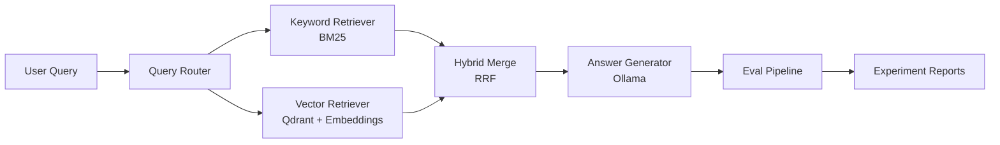

# SpecLens

### Evaluation-Driven RAG with Hybrid Retrieval and Query Routing

A local-first system that combines keyword search, vector retrieval, and routing, then evaluates answer quality, retrieval accuracy, latency, and cost across pipelines.

> Not just a RAG demo. A retrieval system you can measure, compare, and improve.

## Features

- Query routing that selects `keyword`, `vector`, or `hybrid` retrieval
- Hybrid search with BM25, dense retrieval, and Reciprocal Rank Fusion (RRF)
- Citation-grounded answers backed by synthetic engineering documents
- Evaluation pipeline for route accuracy, retrieval recall, hit rate, latency, and cost
- Experiment runner for comparing retrieval strategies
- Local-first stack with FastAPI, Qdrant, sentence-transformers, and Ollama

## Architecture



## Demo

### Question

```text
Does checkout support automatic refunds?
```

### Answer

```text
No. The retrieved documents conflict: the checkout PRD proposes automatic refunds,
but the MVP payment design says automatic refunds are not supported and release 1.2
only adds admin-triggered refunds.
```

### Sources

- `checkout-redesign.md`
- `payment-service-design.md`
- `release-1.2.md`

### Retrieval Details

- Route: `hybrid`
- Retrieved docs: `6`
- Expected docs hit: `3/3`
- Local Ollama latency: `5.8s` in the current test run

## Evaluation

SpecLens benchmarks retrieval strategies across 50 labeled questions spanning exact lookup, semantic search, multi-document reasoning, conflict resolution, and incident analysis.

| Strategy | Route Accuracy | Retrieval Recall | Avg Latency |
|----------|----------------|------------------|-------------|
| Keyword only | 0.26 | 0.95 | 0.06ms |
| Vector only | 0.10 | 1.00 | 90.94ms |
| Hybrid | 0.64 | 1.00 | 32.20ms |
| Router-based | 1.00 | 1.00 | 54.54ms |

These reports are generated from the local benchmark set in [`data/eval/questions.jsonl`](data/eval/questions.jsonl) and written to [`reports/experiments`](reports/experiments).

## Why This Project

Most RAG demos rely purely on vector search. SpecLens is built to show a stronger systems point:

- Exact API-style queries are often better handled by keyword retrieval
- Semantic and rationale questions benefit from dense retrieval
- Conflict-heavy engineering questions need hybrid retrieval and routing
- Retrieval quality should be measured, not assumed

## Quick Start

```bash
git clone https://github.com/luxinyue0910/speclens
cd speclens

python3 -m venv .venv
.venv/bin/pip install -r requirements.txt
cp .env.example .env

docker compose up -d
ollama pull phi3

.venv/bin/python -m rag.ingestion.build_indexes
.venv/bin/uvicorn apps.api.main:app --reload
```

Ask a question:

```bash
curl -X POST http://localhost:8000/ask \
  -H "Content-Type: application/json" \
  -d '{"question":"Does checkout support automatic refunds?","retriever":"auto","generator":"ollama"}'
```

Run evaluation:

```bash
.venv/bin/python -m rag.evaluation.run_experiment --retriever auto --generator extractive --top-k 6
```

## API

### `POST /ingest`

Build indexes from `data/docs` and refresh the Qdrant collection.

### `POST /ask`

```json
{
  "question": "Does checkout support automatic refunds?",
  "retriever": "auto",
  "top_k": 6,
  "generator": "ollama"
}
```

### `POST /eval/run`

Run the benchmark pipeline and save JSON and Markdown reports under `reports/experiments`.

## Dataset

SpecLens uses a synthetic engineering knowledge base for a fictional SaaS company, Northstar Commerce. The corpus includes:

- PRDs
- technical design docs
- API docs
- incident postmortems
- release notes

The dataset intentionally includes conflicting evidence so retrieval strategy matters.

## Roadmap

- Heading-aware chunking for more realistic retrieval granularity
- Optional cross-encoder reranking
- LLM judge for faithfulness and citation accuracy
- Next.js dashboard for interactive experiment browsing
- GitHub Actions eval regression checks
